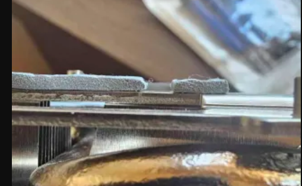
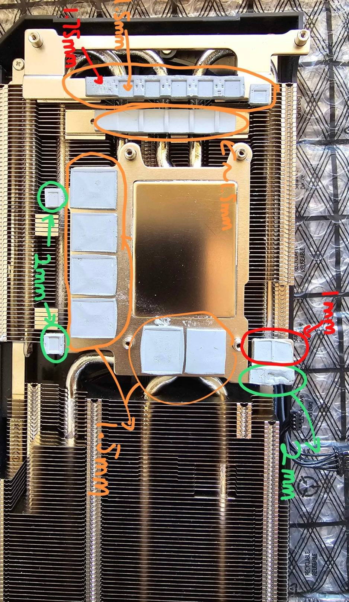

# ASROCK-Arc-B570-Thermal-Pads
This is a guide to thermal pad thickness and a practice for me to write in markdown mode in vim lol

### Measurement Method
I measured and rounded up to the nearest .25 mm for all the thermal pads, as the pads are often compressed down from those .25mm thickness.

## PCB Side
There are 3 thermal pads on the pcb side contacting each inductor, all located around the top of the pcb(i.e near the connectors)

2 at the top side(mem voltage): 1.5mm
1 near the 8 pin: 1.75mm

## Heatsink Side

Memory: 1.5mm across
2 Bottom Memory VRM: 2mm for the drMOS and 1mm for the coils
2 Top side memory vram: 2mm for the drMOS
Core side vrm: 1.5mm for the coils, 1.5mm for the drMOS(but 1.75 for the uncompressed part)
Topside controller: 1.5mm 

### Comparing topside controller with coreside vrm drMOS thermal pads
I doubted myself when I measured the thickness, but on a side by side comparison it is 1.75mm uncompressed for the vrm drMos pads.

